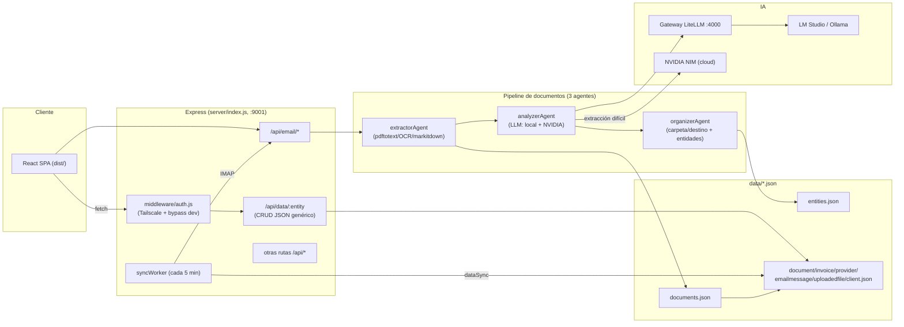

# Informe técnico — SynK‑IA (sinkia-next)

> Sistema de gestión integral para **Chicken Palace Ibiza, S.L.** (CIF B56908486).
> Documento generado el 2026‑06‑28. Describe la arquitectura, el código, la
> configuración y los cambios aplicados en la última sesión de trabajo.

---

## 1. Resumen ejecutivo

SynK‑IA es una aplicación full‑stack (React + Express/Node) que automatiza la
gestión documental y de negocio de un restaurante:

- **Ingesta automática de correos** (IMAP/Gmail) y sus adjuntos.
- **Procesamiento con IA** de cada documento: extracción de texto → análisis
  estructurado (clasificación + campos) → organización (carpeta/destino +
  creación de entidades como proveedores/trabajadores/clientes).
- **Paneles de negocio**: facturas, proveedores, documentos (Archivo Global),
  RRHH, buzón inteligente, dashboards ejecutivos y un asistente "CEO Brain".
- **Stack de IA local + nube**: un gateway LLM local (LiteLLM en `:4000`) con
  modelos locales (LM Studio / Ollama) y, para extracción difícil, un modelo
  potente en la nube (NVIDIA NIM).

La "magia" del sistema: los correos/documentos entran y quedan clasificados,
con su proveedor/importe/fecha correctos y archivados en su carpeta, listos para
consultarse en los paneles.

---

## 2. Stack tecnológico

- **Frontend**: React 18, Vite 6, React Router 7, TanStack Query 5, Tailwind
  CSS 3, Radix UI, lucide-react, recharts, sonner (toasts), date-fns/dayjs.
- **Backend**: Node (ESM) + Express 5, WebSocket (`ws`), multer (uploads),
  imap + mailparser (correo), pdf-parse, xlsx, adm-zip, tesseract.js.
- **IA**: Gateway OpenAI‑compatible (LiteLLM `:4000`), LM Studio, Ollama,
  MarkItDown (Python) para conversión a Markdown, NVIDIA NIM (cloud).
- **Persistencia**: ficheros JSON en `data/` (un store por entidad) — ver §8.
- **Build/Run**: `npm start` sirve el build de producción de Vite (`dist/`).

---

## 3. Arquitectura general



Flujo de datos resumido:
1. El **worker** (cada 5 min) descarga correos IMAP nuevos y guarda adjuntos.
2. `processDocument` ejecuta **extractor → analyzer → organizer** y escribe en
   `documents.json` + `entities.json`.
3. `dataSync` proyecta esos datos a los stores por entidad (`document.json`,
   `invoice.json`, `provider.json`, `uploadedfile.json`, `emailmessage.json`,
   `client.json`) que es lo que leen las páginas del frontend vía `/api/data/*`.

---

## 4. Estructura del proyecto

```
sinkia-next/
├── src/                      # Frontend React
│   ├── api/                  # synkiaClient.js, entities.js (capa de compatibilidad)
│   ├── services/             # dataService, authService, integrationsService...
│   ├── contexts/AuthContext.jsx
│   ├── config/roles.js       # roles, permisos y permisos por ruta
│   ├── pages/                # ~60 páginas (index.jsx define el routing)
│   └── components/           # UI (Radix), auth/ProtectedRoute, dashboard...
├── server/                   # Backend Express (ESM)
│   ├── index.js              # arranque, montaje de rutas, estáticos SPA
│   ├── env-loader.mjs        # carga .env ANTES que cualquier módulo
│   ├── syncWorker.js         # orquestador 24/7 (email cada 5 min)
│   ├── middleware/auth.js    # Tailscale-only + bypass dev + CORS
│   ├── routes/               # email, data, documents, auth, markitdown, ...
│   ├── agents/               # pipeline.js, extractorAgent, analyzerAgent, organizerAgent
│   ├── services/             # documentProcessor, dataSync, agentCore
│   └── tools/scripts/        # markitdown_wrapper.py, convert-to-markdown.py
├── data/                     # "base de datos" JSON (un fichero por entidad)
├── uploads/                  # adjuntos guardados
├── scripts/                  # utilidades añadidas (ver §13)
├── dist/                     # build de producción (servido por npm start)
└── .env                      # configuración (ver §11)
```

---

## 5. Backend (Express)

### 5.1 Arranque — `server/index.js`
- **Primera línea**: `import './env-loader.mjs'` para cargar `.env` **antes** que
  cualquier otro módulo (evita que agentes lean variables vacías). *(corregido en
  esta sesión — ver §12).*
- Monta middlewares (JSON 50 MB, rate‑limiter que exime localhost/Tailscale),
  `setupAuth(app)`, bot de Telegram y un logger en dev.
- Proxies a servicios locales del stack IA: `/webui` (Open WebUI :3030), `/n8n`
  (:5678), `/searxng` (:8888), `/qdrant` (:6333) y `/api/commerce` (Mac Mini).
- Monta rutas de negocio: `/api/email`, `/api/biloop`, `/api/health`,
  `/api/files`, `/api/admin`, `/api/documents`, `/api/process`,
  `/api/trabajadores`, `/api/filemanager`, `/api/orchestrator`, `/api/accounting`,
  `/api/legal`, `/api/hr`, `/api/learning`, `/api/classify`, `/api/integrations`,
  `/api/hermes`, `/api/opencode`, `/api/markitdown`, `/api/system`, `/api/data`,
  `/api/extractions`, `/api/ollama` + `/api/ai`.
- Sirve la SPA desde `dist/` (fallback `index.html` para rutas no‑API).
- Arranca WebSockets (terminal, shell, hermes, opencode) y el **syncWorker**.
- `PORT` por defecto 3001; en operación se usa **9001** (`PORT=9001 npm start`).

### 5.2 Autenticación — `server/middleware/auth.js`
- Modelo "**Tailscale‑only**": solo se permite el acceso desde IPs de Tailscale
  (`100.64.0.0/10`) o red local; el resto recibe 403.
- **Bypass de desarrollo**: si `DISABLE_TAILSCALE_AUTH=true`, se omite la
  comprobación (modo local). *(activado en esta sesión).*
- Rutas exentas (webhooks/health): `/api/telegram`, `/api/health`, `/api/ai`,
  `/api/data/public`, sync, etc.
- Token admin opcional vía `Authorization: Bearer <ADMIN_TOKEN>` o `?token=`.
- CORS configurable con `CORS_ORIGINS`.

### 5.3 API de datos genérica — `server/routes/data.js`
- CRUD sobre `data/<entidad>.json` con lista blanca de entidades
  (`ALLOWED_ENTITIES`).
- Endpoints: `GET /:entity` (sort/limit), `POST /:entity/filter`,
  `GET/POST/PUT/DELETE /:entity[/:id]`, `PUT /:entity/bulk` (merge/replace).
- Es la fuente que consumen casi todas las páginas del frontend.

### 5.4 Rutas de email — `server/routes/email.js`
Capa HTTP sobre `emailAgent`: `/test` (conexión IMAP), `/stats`, `POST /sync`
(sincronización con IA), `/scan`, `/fetch`, `/documents`, `/invoices`,
`/payslips`, `/workers`, `/providers`, `/fetch-page`.

### 5.5 Worker — `server/syncWorker.js`
- Arranca al iniciar el servidor; ejecuta `emailAgent.syncEmails()` y luego
  `dataSync.syncAll()` **cada 5 minutos**.
- Revo está desactivado (API denegada por el proveedor).

---

## 6. Pipeline de procesamiento de documentos (el núcleo)

Tres agentes encadenados en `server/agents/pipeline.js` (`processFile`) y también
usados por `server/services/documentProcessor.js` (`processDocument`, que es el
que invoca el flujo de email):

### 6.1 Extractor — `server/agents/extractorAgent.js`
Motor universal de extracción de texto para cualquier formato:
- **PDF**: `pdftotext` (poppler) primero — robusto; si no hay capa de texto,
  OCR (`pdftoppm` + Tesseract, o `glm-ocr`/visión vía gateway).
- **Office** (docx, pptx, odt, ods…): **MarkItDown** (Python) → Markdown.
- **Imágenes**: OCR (glm-ocr / visión / Tesseract).
- Email (.eml/.msg), HTML, RTF, ICS, OFX/QIF, ZIP/RAR/7z/TAR, texto/código.
- Trunca de forma inteligente a 12.000 chars.

### 6.2 Analizador — `server/agents/analyzerAgent.js`
- Llama a un LLM con un *system prompt* muy específico para Chicken Palace y
  devuelve **JSON estructurado** (tipo, emisor/receptor con rol, trabajador,
  importes, fechas, referencias, conceptos, tags, urgencia, acción).
- Taxonomía: `factura_recibida`, `factura_emitida`, `nomina`, `finiquito`,
  `albaran`, `ticket`, `contrato`, `multa`, `notificacion_hacienda`, etc.
- Parseo JSON robusto (limpia *thinking*, repara JSON truncado) con *fallback*.
- **Modelo híbrido (B3)**: para extracción usa primero el modelo potente en la
  nube (**NVIDIA `meta/llama-3.3-70b-instruct`**) y cae al gateway local si falla
  o si la entrada es visión. *(añadido en esta sesión).*

### 6.3 Organizador — `server/agents/organizerAgent.js`
- Asigna **carpeta virtual** (árbol `gastos/facturas/<subcategoría>/<año>`,
  `laboral/nominas/<trabajador>`, `fiscal/hacienda`, etc.).
- Genera **nombre normalizado** (`2024-02-20_factura-recibida_proveedor_total.pdf`).
- **Crea/actualiza entidades** en `entities.json` (proveedores, trabajadores,
  clientes) con deduplicación por CIF/DNI/NSS/nombre.
- Determina **acciones pendientes** (pagar, contabilizar, urgente, revisar).
- Reglas personalizables vía `data/organizer_rules.json`.

---

## 7. Servicios clave

- **`server/services/documentProcessor.js`** — Punto de entrada del flujo de
  email/subidas. Tras los cambios de esta sesión ejecuta extractor → analyzer →
  organizer y persiste en `documents.json` (con `analisis` + `organizacion`).
- **`server/services/dataSync.js`** — Proyecta `documents.json` (+ legacy
  `filemanager_docs.json`) y `entities.json` a los stores por entidad que lee el
  frontend. Incluye `syncDocuments/Providers/Invoices/Emails/Clients/UploadedFiles`.
- **`server/services/agentCore.js`** — Cliente único hacia el gateway LLM
  (`:4000`), con registro de tareas (classify, analyze, deep…), alias de modelo
  (`local-fast`, `local-reason`) y parseo JSON seguro.

---

## 8. Modelo de datos (capa JSON)

`data/` actúa como base de datos; cada entidad es un fichero JSON:

- **Stores de procesamiento** (fuente): `documents.json` (`{documents, entities}`),
  `entities.json` (`{proveedores, trabajadores, clientes}` / o `providers/...`),
  `emails.json`, `email_state.json`, `filemanager_docs.json` (pipeline legacy).
- **Stores por entidad** (derivados, los lee el frontend vía `/api/data/*`):
  `document.json`, `invoice.json`, `provider.json`, `client.json`,
  `emailmessage.json`, `uploadedfile.json`, `employee.json`, etc.
- La **capa de sincronización** (`dataSync`) copia de los primeros a los segundos.

> ⚠️ **Deuda técnica conocida**: dos pipelines/stores históricos + escritura de
> ficheros completos sin bloqueo. Es el origen de varios bugs y el motivo de la
> migración planificada a **SQLite** (ver §14, fase B2).

---

## 9. Frontend (React)

- **Routing** — `src/pages/index.jsx`: ~50 rutas protegidas con
  `<ProtectedRoute>`. Raíz redirige a `/ceodashboard`. Rutas públicas:
  `/portallogin`, `/ordersdashboard`.
- **Auth** — `src/contexts/AuthContext.jsx`: carga el usuario vía `User.me()`;
  en hosts de confianza (localhost/127.0.0.1/Tailscale/LAN privada) crea un
  usuario **CEO de desarrollo** para entrar sin login. *(ampliado en esta sesión
  para aceptar IP/Tailscale).*
- **Roles/permisos** — `src/config/roles.js`: roles `ceo` > `admin` > `employee`,
  permisos por ruta (`ROUTE_PERMISSIONS`). El CEO tiene todos los permisos.
- **Capa de datos** — `src/services/dataService.js` (`/api/data/:entity`),
  `authService.js` (JWT en localStorage), expuestos como `synkia.entities`,
  `synkia.auth`, etc. en `src/api/synkiaClient.js`.
- **Páginas destacadas**:
  - `CEODashboard`, `CEOBrain` (asistente IA exclusivo CEO/Admin).
  - `SmartMailboxFixed` (buzón — ahora con correos reales).
  - `Invoices`, `Providers` (proveedores real), `DocumentArchive` (Archivo Global).
  - `Staff`, `Payrolls`, `Timesheets`, RRHH, `Biloop*`, `RevoDashboard`, etc.

---

## 10. Integraciones

- **Email/Gmail IMAP** — `info@chickenpalace.es` (IMAP 993, SMTP 587).
- **Telegram** — bot configurado (`server/bots/telegram.js`).
- **Revo POS** — DESACTIVADO (API denegada por Revo); webhooks en `data/revo*`.
- **Gateway LLM (LiteLLM `:4000`)** — enruta alias a LM Studio/Ollama/nube.
- **NVIDIA NIM** — modelo potente para extracción difícil (cloud).
- **Proxies** — Open WebUI, n8n, SearXNG, Qdrant, Commerce (Mac Mini).
- **MarkItDown** — conversión a Markdown vía venv Python `~/markitdown-venv`.

---

## 11. Configuración (`.env`)

> Los valores sensibles aparecen **enmascarados**. Variables principales:

- **Ollama**: `OLLAMA_URL=http://localhost:11434`, `OLLAMA_MODEL=llama3.2:3b`,
  `OLLAMA_NUM_PARALLEL=1`, `OLLAMA_MAX_LOADED_MODELS=1`.
- **LM Studio / Gateway**: `LMSTUDIO_URL=http://127.0.0.1:4000/v1`,
  `LMSTUDIO_API_KEY=••••`, `LMSTUDIO_MODEL=negentropy-claude-opus-4.7-9b`.
- **Modelos de enrutamiento**: `CLASSIFY_MODEL=local-fast`,
  `ANALYZER_MODEL=local-reason`, `DOC_AGENT_MODEL`, etc.
- **Cloud (claves)**: `NVIDIA_API_KEY=nvapi-••••` (FUNCIONA),
  `OPENROUTER_API_KEY=••••` (inválida), `GOOGLE_GEMINI_API_KEY=AIza••••` (inválida).
- **Modelo potente (B3)**: `STRONG_LLM_BASE_URL=https://integrate.api.nvidia.com/v1`,
  `STRONG_LLM_MODEL=meta/llama-3.3-70b-instruct`, `ANALYZER_USE_CLOUD=true`.
- **MarkItDown**: `MARKITDOWN_EXE=/Users/davidnows/markitdown-venv/bin/python`.
- **Seguridad**: `JWT_SECRET=••••`, `ADMIN_TOKEN=••••`,
  `DISABLE_TAILSCALE_AUTH=true`, `TAILSCALE_ALLOW_LOCAL=true`.
- **Email**: `EMAIL_USER=info@chickenpalace.es`, `EMAIL_APP_PASSWORD=••••`,
  `EMAIL_IMAP_HOST=imap.gmail.com`, `EMAIL_SMTP_HOST=smtp.gmail.com`.
- **Telegram**: `TELEGRAM_BOT_TOKEN=••••`.
- **Revo**: `REVO_TOKEN_LARGO=••••`, `REVO_TENANT=chickenpalaceibiza2`.
- **Directorios**: `UPLOADS_DIR=/Users/davidnows/sinkia-next/uploads`,
  `DATA_DIR=/Users/davidnows/sinkia-next/data`.

> Nota: el `.env` contiene secretos reales. **No** debe subirse al repositorio y
> conviene rotar las claves que hayan quedado expuestas.

---

## 12. Cambios aplicados en esta sesión

### Correcciones de arranque y acceso
1. **`server/index.js`** — `import './env-loader.mjs'` como primera línea, para
   cargar `.env` antes que los módulos (antes `DATA_DIR/UPLOADS_DIR` quedaban
   vacíos y los agentes caían al fallback `/app/...`, fallando con `ENOENT`).
2. **`src/contexts/AuthContext.jsx`** — acceso de desarrollo válido también por
   IP local/Tailscale (antes solo `localhost`) + `setIsLoading(false)` cuando
   hay usuario (evita quedarse en "Verificando acceso…").
3. **`.env`** — `DISABLE_TAILSCALE_AUTH=true` (acceso local sin bloqueo).

### Visualización de datos reales
4. **`src/pages/SmartMailboxFixed.jsx`** — cargaba **correos falsos** (mock);
   ahora carga los reales desde `/api/data/emailmessage`.
5. **`server/services/dataSync.js`** — `syncEmails` asigna `folder='inbox'`
   (la bandeja filtraba por carpeta y salía vacía) + `is_read`/`is_starred`;
   `getAllDocs` ahora lee `documents.json` (antes leía `filemanager_docs.json`,
   casi vacío); compatibilidad de claves `providers/proveedores`.
6. **`src/pages/Providers.jsx`** — era un alias de Facturas; ahora es una página
   real de proveedores (agrega `provider.json` + `invoice.json`).
7. Eliminado `src/pages/SmartMailbox.jsx` (código muerto duplicado).

### Pipeline markdown-first + calidad de extracción
8. **`server/agents/extractorAgent.js`** —
   - **Bug crítico**: `execAsync` **no estaba definido** → rompía TODO el OCR
     (pdftoppm/tesseract) y la nueva ruta pdftotext (lanzaba `ReferenceError`
     silenciado). Definido `const execAsync = promisify(execFile)`.
   - `extractPdf` usa **`pdftotext` primero** (robusto) y `pdf-parse`/OCR como
     fallback (pdf-parse lanzaba "bad XRef entry" de forma intermitente).
   - Rutas de **MarkItDown** locales (antes apuntaban a Docker `/opt`/`/app`).
9. **`server/services/documentProcessor.js`** — `processDocument` ahora ejecuta
   extractor → analyzer → organizer y guarda `analisis` + `organizacion`.
10. **`server/agents/analyzerAgent.js`** — **modelo híbrido (B3)**: extracción
    difícil vía NVIDIA `llama-3.3-70b` con fallback local. Resultado:
    extracción consistente (p. ej. total `106,59 €` estable vs. valores
    erráticos del modelo local).
11. **`server/services/dataSync.js`** — `syncUploadedFiles` emite el formato que
    espera `DocumentArchive` (`filename`, `processing_status`,
    `metadata.destination{section,type,name}`, `amount`), de modo que los
    documentos muestran su **destino/importe/estado** en vez de "Sin destino".

### Verificación
12. Verificación visual con **Playwright** (headless) de `/smartmailbox`,
    `/documentarchive`, `/invoices`, `/providers`, `/ceobrain` — confirmado que
    muestran datos reales. CEO Brain quedó **accesible** (antes bloqueaba por una
    lista de emails fija; ahora usa `AuthContext`).

---

## 13. Scripts añadidos (`scripts/`)

- `ui-verify.mjs` — verificación headless (Playwright) de páginas clave (vuelca
  texto del DOM + screenshots en `/tmp/ui-verify`).
- `test-pipeline.mjs` — procesa 1 archivo por `pipeline.processFile` (3 agentes).
- `test-doc.mjs` — procesa 1 archivo por `documentProcessor.processDocument`
  (flujo de email).
- `probe-llm.mjs` — detecta qué proveedor cloud responde (NVIDIA/OpenRouter/Gemini).
- `reprocess-all.mjs` — reprocesa en sitio los documentos de `documents.json`
  con el pipeline actual (B3). Uso: `node scripts/reprocess-all.mjs [límite]`.

---

## 14. Estado actual y pendientes (roadmap)

### Estado de datos (a fecha del informe)
- `documents.json`: 216 documentos; **~70 reprocesados** con el modelo potente,
  14 con organización. Aún quedan ~123 `other` + 12 `invoice` (taxonomía antigua
  en inglés) **sin reclasificar**: el reproceso quedó **incompleto** (la sesión/
  equipo se cerró durante la ejecución nocturna).
- `entities.json`: 6 proveedores (crecerá al completar el reproceso).

### Fases del plan
- **Fase A — Wins rápidos**: ✅ COMPLETADA (Proveedores, buzón, markitdown).
- **Fase B1 — Pipeline markdown-first + archivado**: ✅ COMPLETADA y verificada.
- **Fase B3 — Modelo híbrido (NVIDIA)**: ✅ COMPLETADA.
- **Reproceso de documentos antiguos**: 🟡 EN CURSO/INCOMPLETO — **relanzar**
  `node scripts/reprocess-all.mjs` hasta completar los ~216.
- **Fase B2 — Migración a SQLite** (fuente única, elimina la capa de sync
  frágil): ⏳ PENDIENTE (enfoque conservador acordado: construir en paralelo,
  migrar datos y cambiar lecturas solo cuando esté verificado).
- **Fase C — Backend de chat de CEO Brain** (`synkia.agents`): ⏳ PENDIENTE — hoy
  `synkia.agents` no existe; el chat no genera respuestas.
- **Fase 4 — Repaso de errores** con `ui-verify`: ⏳ PENDIENTE.

### Otros problemas conocidos
- Concurrencia de escritura sobre los JSON (worker cada 5 min + procesos
  puntuales) → se resuelve con SQLite (B2).
- Claves cloud de OpenRouter y Gemini inválidas (solo NVIDIA operativa).
- `/api/email/providers` devuelve 0 (usa documentos normalizados sin `analisis`);
  la página de Proveedores se reorientó a `/api/data/*` para evitarlo.

---

## 15. Cómo ejecutar / operar

```bash
# Arrancar el servidor (sirve la SPA de dist/ en el puerto 9001)
cd /Users/davidnows/sinkia-next
PORT=9001 npm start

# Reconstruir el frontend tras cambios en src/
npm run build

# Reprocesar documentos con IA (modelo potente)
node scripts/reprocess-all.mjs            # todos
node scripts/reprocess-all.mjs 10         # solo 10 (prueba)

# Verificación visual headless
node scripts/ui-verify.mjs                # screenshots en /tmp/ui-verify
```

Acceso local: abrir `http://localhost:9001` (el host `localhost` activa el
usuario CEO de desarrollo). La sincronización de correo corre sola cada 5 min.

---

*Fin del informe.*
